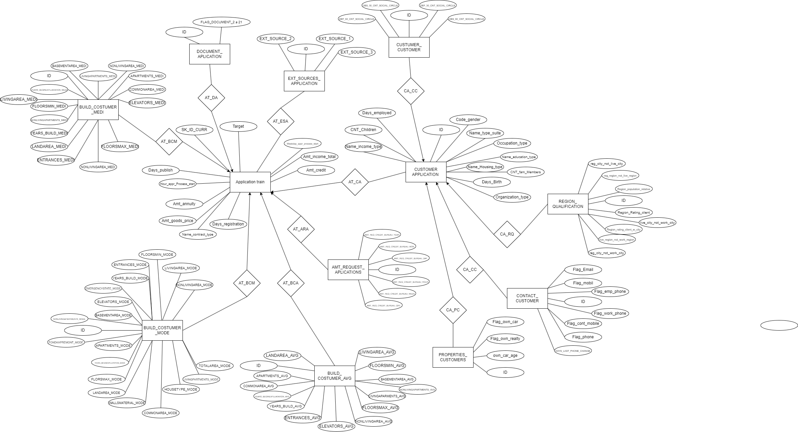

# Home Credit Database Management System

Este repositorio contiene el desarrollo de un sistema de gestión de bases de datos (SGBD) utilizando **SQL Server**, basado en el caso de estudio de la empresa de servicios financieros **Home Credit**. El objetivo del proyecto es mejorar la eficiencia en la gestión de datos mediante la implementación de un modelo de base de datos que cumpla con los principios de **normalización, optimización, seguridad** y **alta disponibilidad**. 

## Descripción del Proyecto

El sistema fue diseñado para abordar problemas críticos de gestión de datos en Home Credit, como la falta de normalización, redundancia, seguridad insuficiente y tiempo de inactividad. El proyecto incluye el desarrollo de:

- Un modelo **E-R** y un modelo **relacional**.
- **10 tablas** con al menos 5 atributos.
- Tres esquemas para dividir lógicamente las tablas.
- Un **migrador** para actualizar la base de datos.
- Un **servidor de auditoría** para almacenar transacciones.
- **Funciones y triggers** para garantizar la integridad de los datos.
- **Índices no clúster** y **consultas SARGABLES** para mejorar la eficiencia de las consultas.

## Estructura del Repositorio

- `/diagrams`: Contiene los diagramas del modelo entidad-relación (E-R) y del modelo relacional.
- `/migrations`: Scripts SQL para la migración de datos desde los archivos CSV.
- `/stored_procedures`: Procedimientos almacenados y funciones desarrolladas para el sistema.
- `/triggers`: Triggers para verificar la integridad de los datos.
- `/indexes`: Definición de índices no clúster.
- `/queries`: Consultas SARGABLES utilizadas en el proyecto.
- `/docs`: Documentación adicional del proyecto.

## Requisitos

- **SQL Server** para la administración de la base de datos.
- **Python** para la carga de datos masiva en el sistema y la creación del dashboard de 5 componentes con 1 millón de registros.
- **Herramientas de desarrollo** vistas en clase para la implementación de las funcionalidades solicitadas.

## Instalación

1. Clona este repositorio en tu entorno local:
   ```bash
   https://github.com/JennyGS23/SGBD-Home-Credit.git
   ```
2. Carga los scripts de creación de tablas desde `/migrations` en tu instancia de **SQL Server**.
3. Ejecuta los procedimientos almacenados y triggers desde las carpetas correspondientes.
4. Utiliza el migrador para transferir datos desde los archivos CSV al nuevo esquema.
5. Configura los usuarios y permisos como se indica en `/queries/roles.sql`.

## Uso

1. La base de datos se estructura en tres esquemas que dividen las tablas para su administración.
2. Los triggers asegurarán que los valores ingresados sean válidos y mantendrán la integridad de los datos.
3. El servidor de auditoría almacena un historial de todas las transacciones realizadas.
4. El sistema web puede mostrar un **dashboard** de 5 componentes, con carga rápida de datos (1 millón de registros por componente).
5. Las consultas SARGABLES, ubicadas en `/queries`, pueden ser utilizadas como filtros en el sitio web para una mayor eficiencia en la recuperación de información.

## Diagramas

Puedes encontrar los diagramas sobre la estructura de la base de datos en proyecto. Aquí incluimos el **modelo E-R** y el **modelo relacional**, ambos fundamentales para comprender la estructura del sistema y su lógica de negocios.

### Diagrama Relacional


### Modelo Entidad-Relación

