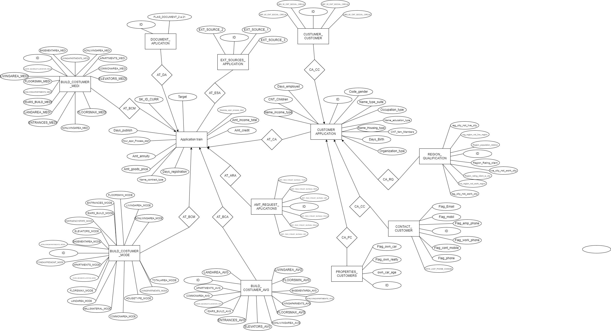

# Mortgage Credit Database Management System

This repository contains the development of a database management system (DBMS) using **SQL Server**, based on the case study of the financial services company **Home Credit**. The objective of the project is to improve efficiency in data management by implementing a database model that complies with the principles of **normalization, optimization, security** and **high availability**.

## Project Description

The system was designed to address critical data management issues at Home Credit, such as lack of normalization, redundancy, insufficient security and downtime. The project includes the development of:

- An **E-R** model and a **relational** model.
- **10 tables** with at least 5 attributes.
- Three schemas to logically divide the tables.
- A **migrator** to update the database.
- An **audit server** to store transactions.
- **Functions and triggers** to ensure data integrity.
- **Nonclustered indexes** and **SARGABLE queries** to improve query efficiency.

## Repository Structure

- `/diagrams`: Contains the diagrams of the entity-relationship (E-R) model and the relational model.
- `/migrations`: SQL scripts for data migration from CSV files.
- `/stored_procedures`: Stored procedures and functions developed for the system.
- `/triggers`: Triggers to verify data integrity.
- `/indexes`: Definition of non-clustered indexes.
- `/queries`: SARGABLE queries used in the project.
- `/docs`: Additional documentation for the project.
- 
## Requirements

- **SQL Server** for database administration.
- **Python** for bulk data loading into the system and creating the 5-component dashboard with 1 million records.
- **Development tools** class views for implementing the requested functionalities.

## Installation

1. Clone this repository to your local environment:
```bash
https://github.com/JennyGS23/SGBD-Home-Credit.git
```
2. Upload the table creation scripts from `/migrations` to your **SQL Server** instance.
3. Run the stored procedures and triggers from the corresponding folders.
4. Use the migrator to transfer data from the CSV files to the new schema.
5. Configure the users and permissions as indicated in `/queries/roles.sql`.

## Usage

1. The database is structured in three schemas that divide the tables for management.
2. Triggers will ensure that the entered values ​​are valid and maintain data integrity.
3. The audit server stores a history of all transactions performed.
4. The web system can display a 5-component **dashboard**, with fast data loading (1 million records per component).
5. SARGABLE queries, located in `/queries`, can be used as filters on the website for greater efficiency in retrieving information.

## Diagrams

You can find diagrams on the structure of the database in the project. Here we include the **E-R model** and the **relational model**, both essential to understand the structure of the system and its business logic.

### Relational Diagram


### Entity-Relationship Model

